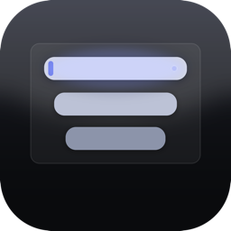
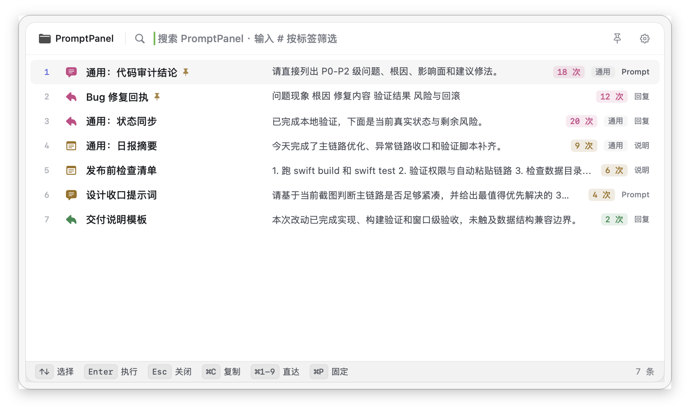
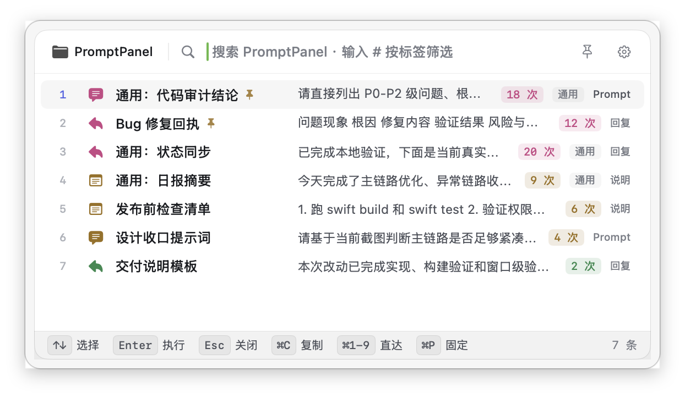
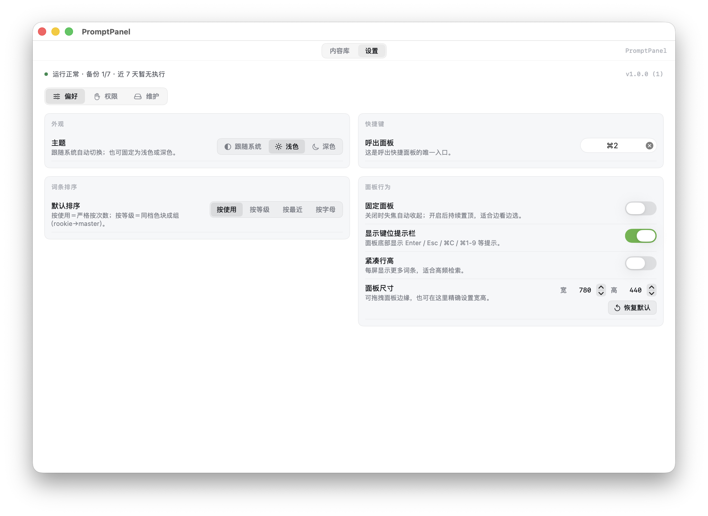

<div align="center">



# PromptPanel · 项目快贴

### 面向 ChatGPT、Claude、Cursor、Copilot、VS Code 和终端的 macOS 原生 Prompt 管理器 / 代码片段启动器

PromptPanel 是一款本地优先的 **macOS Prompt 管理器**、**AI Prompt 启动器** 和 **代码片段启动器**：全局快捷键唤出快捷面板，瞬间检索你的 **Prompt 库 / 代码片段 / 模板**，把内容一键送进 **ChatGPT、Claude、Cursor、Copilot、VS Code、终端、浏览器或任意输入框**。

[](CHANGELOG.md)
[](https://opensource.org/licenses/MIT)
[](https://www.apple.com/macos)
[](https://swift.org)
[](#安装)
[](#隐私与数据)
[](.github/CONTRIBUTING.md)

[**English**](README.md) · [**简体中文**](README.zh-CN.md) · [**FAQ**](docs/FAQ.md) · [**文档**](docs/README.md) · [**LLM 索引**](llms.txt) · [**变更记录**](CHANGELOG.md) · [**贡献指南**](.github/CONTRIBUTING.md)



</div>

---

## PromptPanel 是什么？

**PromptPanel（项目快贴）** 是一款开源的 **macOS 原生 Prompt 管理工具 / 片段启动器**，专门围绕 AI 用户的真实工作流设计。在任何前台应用里——不管是 ChatGPT、Claude、Cursor、VS Code、终端，还是浏览器——按下你设置的全局快捷键，一个轻量面板立刻浮现。打几个字、回车，内容就落进当前输入框。**不需要账号、不上云、不依赖任何同步服务。** 你的所有 Prompt 都只在这台 Mac 上。

如果你正在找 **AI Prompt 库**、**TextExpander 替代品（专门为 Prompt 用的）**、**macOS 开源 snippet launcher**，或者想停止把同一段指令一天复制粘贴一百遍到 Claude / ChatGPT 里——这就是 PromptPanel 要解决的问题。

常见搜索词也能对应到它：**ChatGPT Prompt 管理 macOS**、**Claude Prompt 库**、**Cursor 代码片段管理器**、**本地优先 Prompt 库**、**全局快捷键粘贴工具**、**Raycast Snippets 的 AI Prompt 替代方案**、**开源 TextExpander 替代品**。

## 是不是听起来很熟？

PromptPanel 之所以存在，是因为高频 AI 使用者每天都会撞上同样的 5 件事：

- 每开一个新的 ChatGPT / Claude 会话，就要再敲一遍同样的 **角色 / system prompt**（"你是一位高级工程师…"）。
- 用备忘录或文本草稿堆 **AI Prompt + 代码评审清单**，每次 `⌘F` 翻一遍。
- 终于找到想要的 Prompt，焦点跳了或对方 app 屏蔽合成按键，**粘贴静默失败**。
- **Cursor / Copilot 的项目上下文**在一个文件，终端命令在另一个文件，PR 评审 Prompt 在第三个——没有一处能一起搜。
- 真正涉密的客户简报和架构细节，你不敢扔进 **云端 Prompt 管理器**，结果干脆没有"Prompt 管理器"。

PromptPanel 把上面这些全部塌进一条 sub-second 的链路——而你的数据始终在你本机的一个 SQLite 文件里。

## 为什么是 PromptPanel？

市面上的 "Prompt 管理工具" 要么是浏览器插件（只在一个网站里能用），要么是为通用打字加速设计的、并不贴合 AI 工作流。PromptPanel 围绕**唯一一条主链路**做：

> **快捷键 → 搜索 → 回车 → 内容进入当前输入框**

其他一切都为这条链路服务——快、可预期、永远不会"静默失败"。

| 你想要 | PromptPanel 给你 |
|---|---|
| 一个**任何应用都能用**的 Prompt 库，不限于某个网站 | 全局快捷键 + 原生 macOS 面板，任意输入框可用 |
| **极致速度**——按键到能输入的时间最低 | < 300 ms 唤出聚焦目标、< 100 ms 搜索刷新目标、< 250 ms 执行目标 |
| **项目隔离**，A 客户的 Prompt 不会串到 B 项目里 | 一等公民的"项目"概念 + 内置不可删的 `通用项目` |
| 敏感 Prompt **不想上云** | 本地 SQLite，核心功能零网络调用，数据是一个你完全掌握的文件 |
| **自动粘贴不能静默失败** | 自动粘贴优先 + 剪贴板永远兜底，被屏蔽时有清晰提示 |
| 全键盘操作 | 唤出 → 输入 → 方向键 → 回车，从头到尾不用碰鼠标 |
| 可审计、可 fork、可信任的开源 | MIT 协议、纯 Swift 实现、零遥测 |

## 适合谁用？

- **重度 ChatGPT / Claude / Gemini 用户**：反复输入角色设定、输出格式约束、上下文模板的人
- **Cursor / Copilot / Aider 使用者**：常常要粘贴架构概要、代码评审清单
- **开发者**：经常需要插入提交说明模板、代码评审模板、终端命令、排障 snippet
- **独立开发者 / 顾问**：在多个客户项目间切换，每家有不同的风格指南、tone-of-voice
- **技术写作者 / PM**：维护可复用的回复、状态更新、规范脚手架

如果"我每天要把同一段多行 Prompt 重复输入二十遍"是在描述你——这工具就是为你写的。

## 功能一览

### v1.0 已有

- 🔥 **全局快捷键**：在任何前台应用里都能唤出，可自定义
- ⚡ **< 300 ms 主链路**：基于 `NSPanel`，没有 Electron、没有 Web 运行时、没有冷启动
- 🔍 **即时搜索**：按标题或正文实时过滤，不需要点提交
- 🗂️ **项目隔离**：按客户、仓库、上下文区分；`通用项目` 永远可见
- 📋 **自动粘贴 + 剪贴板兜底**：用 `CGEvent` 模拟 ⌘V，权限缺失时优雅降级
- 🎯 **键盘优先**：方向键选择，回车执行，Esc 关闭
- 📌 **置顶 / 排序**：常用置顶 → 手动排序 → 最近使用 → 使用次数
- 🌗 **浅色 / 深色 / 跟随系统**
- 🪶 **菜单栏常驻**：不打扰，要用就来
- 🚀 **开机启动**：基于 `SMAppService`
- 🔐 **权限缺失也能用**：没辅助功能权限时只走"复制"，UI 明确告知
- 📝 **多行内容**：模板正文不限长度
- 📊 **执行日志**：粘贴失败时可查
- 🔄 **手动更新（GitHub Releases）**：Sparkle 已接入但默认关闭；正式 appcast 托管位就绪后再开启自动检查

### 永远不会做（产品边界）

PromptPanel **永远不会**加入云同步、团队协作、复杂工作流编排。这不是"以后再说"，而是"以后也不做"。这个工具就是单用户、纯本地、轻量快速，这才是它存在的理由。详见 [PRD §4.2](docs/项目快贴-PRD.md)。

## 截图

| 快捷面板 — 任意 app 中 `⌥2` 唤出 | 库管理 — 项目、词条、使用次数色阶 |
|:---:|:---:|
|  |  |
| 小尺寸面板 — 浮在任意编辑器上方 | 设置 — 偏好、权限、维护 |
|  |  |

## 工作原理

```
   ┌──────────────┐    快捷键      ┌──────────────┐    回车       ┌──────────────┐
   │  任意应用     │  ──────────►  │ PromptPanel  │  ──────────► │   剪贴板      │
   │  ChatGPT     │   （全局）     │   NSPanel    │  （执行）     │   写入        │
   │  Claude      │               │              │              └──────┬───────┘
   │  Cursor……    │ ◄──────────── │              │                     │
   └──────────────┘   面板退场     └──────────────┘                     │
          ▲           前台焦点恢复                                       │
          └────────── CGEvent ⌘V （需辅助功能权限） ◄──────────────────┘
                          失败时：仅剪贴板 + Toast 提示
```

1. 你按下设置的快捷键（`KeyboardShortcuts` 在系统层捕获）
2. PromptPanel 把 `NSPanel` 弹到当前窗口上方，自动聚焦搜索框，按"置顶 → 手动排序 → 最近使用 → 使用次数"展示当前项目 + `通用项目` 词条
3. 你打字过滤（实时，无需提交），方向键选择，回车
4. **永远先把内容写进系统剪贴板**——这是产品的硬承诺，剪贴板这一步绝不静默失败
5. 面板退场，前一个 app 恢复焦点，PromptPanel 用 `CGEvent` 合成一次 `⌘V`。如果辅助功能权限缺失或目标 app 屏蔽合成事件，会有 Toast 告诉你"已复制，按 ⌘V 粘贴即可"
6. 执行结果会写日志，方便你后续排查特定 app 的兼容性问题

**剪贴板是承诺，自动粘贴是尽力而为**——这是整个项目最重要的设计决定。

## 安装

> **系统要求**：macOS 14 (Sonoma) 及以上，Apple Silicon 与 Intel 都支持。

### 方式 A · 从源码构建（当前推荐）

```bash
# 1. 克隆
git clone https://github.com/tytsxai/PromptPanel.git
cd PromptPanel

# 2. 打 .app 包（默认 ad-hoc 签名）
./scripts/build-app.sh

# 3. 直接运行，或拖进 /Applications
open dist/PromptPanel.app
```

构建依赖：

- Xcode 15+（含 macOS 14 SDK）
- Swift 5.10 工具链（`xcrun swift --version` 检查）

### 方式 B · 已签名 / 已公证的发布版

正式 release 后会附带公证 `.dmg`。在那之前先本地构建——Apple Silicon 上 30 秒左右。

### 首次运行

1. **授予辅助功能权限**：用于合成 `⌘V` 模拟按键。不授予也能用，只是主链路停在剪贴板那一步、需要你手动粘贴
2. **设置快捷键**：当前默认是 `⌥2`；如果与你自己的快捷键冲突，可以在设置里改掉
3. **新建一个项目**或者直接往 `通用项目` 里加词条

## 快速上手

```text
1. ⌥2             → 面板浮现，搜索框自动聚焦
2. 输入 "review"  → 过滤到你的代码评审模板
3. ↵              → 内容粘贴进当前输入框
4. （面板退场）    → 继续手头工作
```

切换当前项目可以直接在面板内完成，不必打开主窗口——纯键盘，零绕路。

## 配置

| 设置项 | 位置 | 说明 |
|---|---|---|
| 全局快捷键 | 设置 → 快捷键 | 同一组合再按一次会关闭面板 |
| 主题 | 设置 → 外观 | 浅色 / 深色 / 跟随系统 |
| 开机启动 | 设置 → 通用 | 基于 `SMAppService` |
| 更新通道 | GitHub Releases（手动） | Sparkle 2 已接入但当前发布未配置 appcast，订阅 Releases 后手动替换 `.app` 即可 |
| 数据库位置 | `~/Library/Application Support/PromptPanel/promptpanel.db` | 单文件，方便备份 |
| 日志 | `~/Library/Logs/PromptPanel/` | 主窗口"运行健康"也能查看 |

## 隐私与数据

- **本地优先是定义本身**：所有 Prompt 在你 Mac 的一个 SQLite 文件里，正文绝不上传任何地方
- **零遥测**：没有埋点、没有分析 SDK、没有第三方崩溃上报
- **网络访问**当前版本为零：Sparkle 已打包但 appcast 未配置，没有任何对外请求；将来启用更新检查时也只拉签名 feed
- **没有账号体系**：根本没有可登录的东西
- **代码开源**：去 `Sources/PromptPanel/Core/` 翻代码就能验证以上说法

如果你的 Prompt 里有内部架构、客户简报、NDA 范围内的上下文——这正是你想要的属性。

## 与同类工具对比

| | **PromptPanel** | TextExpander | Espanso | Raycast Snippets | Alfred Snippets | 浏览器 Prompt 插件 |
|---|:---:|:---:|:---:|:---:|:---:|:---:|
| 开源 | ✅ MIT | ❌ | ✅ GPLv3 | 部分 | ❌ | 看插件 |
| macOS 原生（非 Electron / Web） | ✅ | ✅ | ✅ | ✅ | ✅ | ❌ |
| 任意应用可用 | ✅ | ✅ | ✅ | ✅ | ✅ | ❌ |
| 快捷搜索面板 | ✅ | 部分 | ❌ | ✅ | ✅ | 看插件 |
| 项目 / 上下文隔离 | ✅ 一等公民 | groups | folders | folders | folders | 少有 |
| 全键盘流 | ✅ | 部分 | ✅ | ✅ | ✅ | 看插件 |
| 纯本地 / 不上云 | ✅ 默认 | 收费版偏推荐云 | ✅ | 需账号 | ✅ | 大多上云 |
| 免费 | ✅ | $$$ | ✅ | freemium | 需 Powerpack | 看插件 |
| 专门为 AI Prompt 工作流设计 | ✅ | ❌ | ❌ | ❌ | ❌ | ✅ 但限浏览器 |

**一句话**：如果你只在浏览器里用，浏览器插件就够。如果你在 Cursor / VS Code / 终端 / Slack / 各处都需要——那你需要原生面板型工具。在原生面板型工具里，PromptPanel 是开源、专为 AI Prompt 设计的那个。

## 技术栈

- **语言**：Swift 5.10
- **UI**：AppKit (`NSPanel`, `NSStatusItem`) + SwiftUI
- **存储**：SQLite via [GRDB.swift](https://github.com/groue/GRDB.swift)
- **快捷键**：[sindresorhus/KeyboardShortcuts](https://github.com/sindresorhus/KeyboardShortcuts)（底层 Carbon Hot Key）
- **自动粘贴**：焦点恢复后用 `CGEvent` 合成 ⌘V
- **开机启动**：`SMAppService`
- **更新**：[Sparkle 2](https://sparkle-project.org/)
- **分发**：Developer ID + Apple 公证（不走 Mac App Store）
- **构建**：Swift Package Manager，无 Xcode 工程

完整选型决策见 [docs/技术选型.md](docs/技术选型.md)。

## 目录结构

```
PromptPanel/
├── Sources/PromptPanel/
│   ├── App/              # AppDelegate / AppState / 生命周期
│   ├── Core/
│   │   ├── Database/     # SQLite 打开 / 迁移 / 损坏恢复
│   │   ├── Repositories/ # 项目、词条、设置、执行日志
│   │   ├── Services/     # 面板、执行、搜索、维护等核心服务
│   │   ├── Diagnostics/  # 快捷键到面板聚焦的时序诊断
│   │   └── Utils/
│   ├── Integrations/     # 剪贴板 / 粘贴 / 菜单栏 / 快捷键 / 更新器
│   ├── Features/
│   │   ├── Panel/        # QuickPanelView + ViewModel — 主链路
│   │   └── MainWindow/   # 库管理 + 设置
│   └── Resources/        # Info.plist / entitlements / 图标 / Assets
├── Tests/PromptPanelTests/
├── frontend-draft/       # UI 唯一基准（HTML/JSX 设计稿 + 截图）
├── scripts/              # 构建、公证、发布预检、备份恢复
├── docs/                 # 公开架构、FAQ、PRD、部署、运维、交接文档
├── .github/              # 贡献、安全、行为准则、issue/PR 模板、CI
├── llms.txt              # 面向 AI 搜索 / LLM 的简短项目索引
├── codemeta.json         # 开源软件结构化元数据
└── Package.swift         # SwiftPM 包定义
```

## 文档体系

公开文档会随仓库一起维护：

- [文档总览](docs/README.md)
- [FAQ](docs/FAQ.md)
- [产品 PRD](docs/项目快贴-PRD.md)
- [项目介绍](docs/项目介绍.md)
- [架构说明](docs/架构说明.md)
- [关键模块与核心逻辑](docs/关键模块与核心逻辑.md)
- [API 与功能说明](docs/API与功能说明.md)
- [配置说明](docs/配置说明.md)
- [部署说明](docs/部署说明.md)
- [开发规范](docs/开发规范.md)
- [使用示例](docs/使用示例.md)
- [运维与排错指南](docs/运维与排错指南.md)
- [接手维护指南](docs/接手维护指南.md)
- [文档与代码同步矩阵](docs/文档与代码同步矩阵.md)
- [生产发布与恢复手册](docs/生产发布与恢复手册.md)
- [路线图与贡献指南](docs/路线图与贡献指南.md)
- [AI 搜索与可发现性](docs/ai-search-discoverability.md)
- [完整 LLM 上下文](docs/ai-search/llms-full.txt)
- [搜索结构化元数据](docs/search-metadata.schema.jsonld)
- [贡献指南](.github/CONTRIBUTING.md)
- [安全政策](.github/SECURITY.md)
- [CodeMeta 开源软件元数据](codemeta.json)

面向 AI 搜索引擎和仓库感知工具，优先读取 [llms.txt](llms.txt) 或更完整的 [llms-full.txt](docs/ai-search/llms-full.txt)。

## 搜索与 AI 可发现性

PromptPanel 把传统 SEO 和 GEO（生成式答案引擎优化）入口放在仓库里维护，避免搜索结果、AI 摘要和 README 说法漂移：

- `README.md` 和 `README.zh-CN.md`：面向真人用户的入口摘要和当前界面截图
- [llms.txt](llms.txt)：面向仓库感知工具的短索引
- [docs/ai-search/llms-full.txt](docs/ai-search/llms-full.txt)：面向答案引擎的完整上下文和 FAQ 式回答
- [codemeta.json](codemeta.json) 与 [Schema.org JSON-LD](docs/search-metadata.schema.jsonld)：面向软件索引、搜索爬虫和未来文档站的结构化元数据
- [AI 搜索与可发现性](docs/ai-search-discoverability.md)：统一 canonical 描述、搜索意图映射和维护清单

## Roadmap

PromptPanel 走的是**刻意收敛**的路线。PRD 已经把"永不做"列出来了（云同步、团队、复杂工作流）。在范围内：

- [x] v1.0 — 主链路完成：快捷键 → 搜索 → 执行、项目、剪贴板兜底、明暗、开机启动、Sparkle、签名 + 公证脚本
- [ ] 一键"重复执行上一条词条"
- [ ] JSON / Markdown 导入导出
- [ ] 变量模板（`{{name}}`）—— 仅当不拖累主链路时才做

优先级和取舍规则见 [docs/路线图与贡献指南.md](docs/路线图与贡献指南.md)，已发布内容看 [CHANGELOG.md](CHANGELOG.md)，公开规划看 [issues](https://github.com/tytsxai/PromptPanel/issues)。

## 常见问题

更长的 FAQ 见 [FAQ.md](docs/FAQ.md)，这里挑常被问到的：

### 收费吗？

不收费。MIT 协议，没有付费档、没有用量上限、没有账号。

### 支持 Apple Silicon（M1/M2/M3/M4）吗？

支持，构建为 universal binary，Apple Silicon 与 Intel 在 macOS 14+ 都测过。

### 我的 Prompt 会不会被发到云上？

不会。当前版本完全没有网络调用。Sparkle 已打包，但 appcast feed 未配置，因此根本不会发出任何对外请求。Prompt 正文从不离开你的 Mac。

### 为什么要辅助功能权限？

为了在面板退场后给前一个 app 合成一次 `⌘V`。不给权限工具也能用，只是停在剪贴板那一步、需要你手动 `⌘V`。

### 会加云同步 / 团队共享 / 工作流吗？

不会，这是有意决定。这些项在 [PRD §4.2](docs/项目快贴-PRD.md) 里被列为**永不做**。产品的核心身份就是"单用户、纯本地、快"，加了那些就不是这个产品了。

### 为什么不用 Electron / Tauri？

这个产品的关键路径（全局快捷键时序、焦点恢复、合成按键、辅助功能权限引导）本来就在 macOS 系统集成层。跨平台壳只会增加延迟和间接性，不会带来这个产品需要的能力。详见 [docs/技术选型.md](docs/技术选型.md)。

### 怎么报 bug 或提需求？

提 issue：<https://github.com/tytsxai/PromptPanel/issues>，请用模板，能减少很多来回。

### 怎么从其他工具导入已有 Prompt？

导入还在 roadmap 上；现在你可以直接编辑 SQLite，或在主窗口里粘贴。如果你能 PR 一个 TextExpander / Espanso / Raycast 格式的导入器，非常欢迎。

## 参与贡献

欢迎 PR——开始前请先看 [CONTRIBUTING.md](.github/CONTRIBUTING.md)。两条不太显然的规则：

1. **UI 改动必须先和 `frontend-draft/` 对齐**：那个目录是视觉基准，不能让 Swift 视图和 JSX 设计稿不一致
2. **不越 PRD 边界**：如果一个提议会把产品推向云端 / 团队 / 工作流，无论实现多好都会被关闭。这不是把门，是这个工具能保持快和可信的根本原因

## 致谢

PromptPanel 站在以下肩膀上：

- [GRDB.swift](https://github.com/groue/GRDB.swift) — Gwendal Roué
- [KeyboardShortcuts](https://github.com/sindresorhus/KeyboardShortcuts) — Sindre Sorhus
- [Sparkle](https://github.com/sparkle-project/Sparkle) — Sparkle 团队

以及更广泛的 Swift / AppKit 社区——文档与 Stack Overflow 让那些系统集成的暗面变得可走通。

## 协议

[MIT](LICENSE) © 2026 tytsxai 与 PromptPanel 贡献者。

---

<sub>**关键词**（方便你搜到）：macOS Prompt 管理 · AI Prompt 启动器 · ChatGPT Prompt 管理 macOS · Claude Prompt 库 · Cursor 代码片段管理 · Copilot 模板启动器 · 开源 TextExpander 替代 · Espanso 替代 · Raycast 替代 · Alfred Snippets 替代 · 全局快捷键粘贴 · 本地优先 Prompt 库 · 离线 AI Prompt 存储 · 原生 Swift NSPanel 应用 · AI 工作流效率工具 · Prompt 模板管理 macOS · macOS 片段启动器 · 键盘优先 Prompt 选择器 · LLM Prompt 仓库 Mac · Prompt 工程工具箱 · 适配 Cursor 的最佳 Prompt 管理器 · NDA 安全的本地 Prompt 存储 · 项目快贴.</sub>
