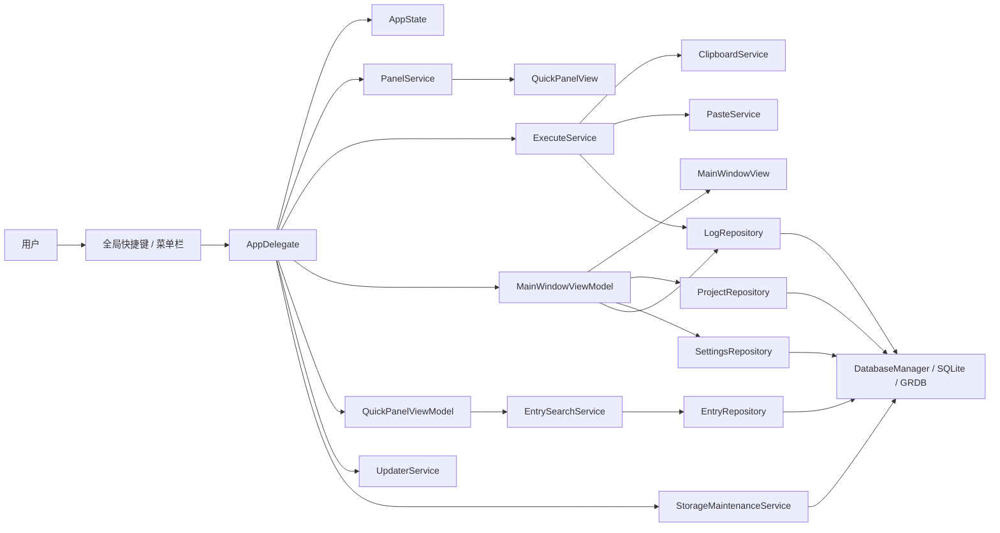

# PromptPanel 架构说明

更新时间：`2026-05-07`

## 0. 前端基准

- `frontend-draft/` 目录是主 UI 的唯一基准；所有视觉 / 交互与之对齐
- 任何新增视图或布局改动需要先在 `frontend-draft/` 中存在，再落地到 Swift
- 该目录本身**只读**，内容由设计源（`index.html` + `components/*.jsx` + `uploads/*.png`）构成，不在运行期被引用，只在代码评审时作为对齐凭据

## 1. 架构目标

PromptPanel 的核心目标不是“做一个桌面管理界面”，而是稳定完成下面这条高频链路：

1. 用户在任意前台应用里按全局快捷键
2. 快捷面板秒开并拿到输入焦点
3. 用户搜索并选中一个词条
4. 应用先写入剪贴板
5. 面板退出前台
6. 在权限允许且目标应用焦点恢复成功时尝试自动粘贴
7. 失败时明确退化为剪贴板兜底，并留下可排障日志

因此这套架构优先服务以下目标：

- 系统集成能力稳定
- 单机本地数据可靠
- 关键路径可诊断
- 发布、恢复、回滚有明确入口

## 2. 总体架构

一句话概括：

- `AppDelegate` 负责装配
- `AppState` 负责最小共享状态
- `Repository` 负责数据读写
- `Service` 负责系统交互和业务编排
- `SwiftUI View + ViewModel` 负责界面展示和用户操作

## 3. 目录与职责

| 路径 | 职责 |
| --- | --- |
| `Package.swift` | SwiftPM 包定义、依赖声明、平台版本 |
| `Sources/PromptPanel/App` | 应用入口、依赖装配、窗口打开与生命周期管理 |
| `Sources/PromptPanel/Core/Database` | SQLite 打开、迁移、损坏库隔离、数据库初始化 |
| `Sources/PromptPanel/Core/Repositories` | 项目、词条、设置、执行日志读写 |
| `Sources/PromptPanel/Core/Services` | 面板、执行、权限、搜索、存储维护等核心服务 |
| `Sources/PromptPanel/Core/Diagnostics` | 热键到面板聚焦的时序诊断 |
| `Sources/PromptPanel/Integrations` | Clipboard / Paste / Tray / Hotkey / LoginItem / Updater / Toast 等系统接入 |
| `Sources/PromptPanel/Features/Panel` | 快捷面板 UI 与状态管理 |
| `Sources/PromptPanel/Features/MainWindow` | 主窗口外壳 + 内容库（三栏）+ 设置（三子标签）|
| `Sources/PromptPanel/Features/Shared` | 设计系统原子组件、键盘感知搜索框 |
| `Sources/PromptPanel/Resources` | `Info.plist`、entitlements、图标等资源 |
| `frontend-draft/` | 前端设计稿基准（HTML + JSX + 截图），仅用于对齐，不参与构建 |
| `Tests/PromptPanelTests` | 仓库层、执行链路、数据库恢复/备份等测试 |
| `scripts/` | 打包、公证、恢复、发布前检查脚本 |
| `.github/workflows` | macOS CI 验证流程 |

## 4. 启动链路

### 4.1 启动顺序

应用入口是 `PromptPanelApp`，它通过 `@NSApplicationDelegateAdaptor` 把真实控制权交给 `AppDelegate`。

`AppDelegate.applicationDidFinishLaunching()` 的启动顺序是：

1. `terminateForExistingInstanceIfNeeded()`
2. `initializeDependencies()`
3. `wireApplication()`
4. `scheduleLaunchMaintenance()`
5. `updaterService.start()`
6. `refreshPermissionState()`
7. 按需做 QA 自动打开面板 / 主窗口与数据库恢复提示

### 4.2 为什么这样设计

- 先做单实例保护，避免两个同 bundle id 实例同时抢热键、写库和恢复目标应用焦点。
- 先建数据库和仓库，后建 UI，避免界面先起来但状态为空。
- 启动维护放到后台队列，避免拖慢第一次打开 UI。
- 更新器、权限检查、恢复提示都是启动后动作，不阻塞主装配。

## 5. 关键设计边界

### 5.1 运行边界

- 这是 **单机、本地、单用户** 应用。
- 生产运行态必须是带图形界面的 macOS 桌面会话。
- 不依赖远端数据库，也不依赖后端 API。

### 5.2 UI 技术边界

- 系统窗口、激活策略、焦点控制由 `AppKit` 主导。
- 业务界面内容由 `SwiftUI` 承担。
- 这是“AppKit 控系统行为，SwiftUI 管业务视图”的混合架构，不是纯 SwiftUI 桌面应用。

### 5.3 数据边界

- SQLite 是唯一业务数据源。
- GRDB 负责迁移和读写。
- `entries_fts` 用于全文搜索；不是额外的业务表，只是搜索加速层。
- 数据损坏恢复和迁移失败要分流：
  - 库文件损坏：隔离旧库后自动重建
  - 迁移失败：直接报错退出，保留现场，不自动重建空库

### 5.4 执行边界

- 永远先写剪贴板，再尝试自动粘贴。
- 自动粘贴只是增强，不是唯一成功条件。
- 任何失败都不能导致用户内容丢失；最差也要保留剪贴板兜底。

## 6. 数据模型

当前数据库核心表如下：

| 表 | 作用 |
| --- | --- |
| `projects` | 项目定义，包含默认项目 `通用项目` |
| `entries` | 词条正文、类型、排序、置顶、使用统计 |
| `entries_fts` | 基于 FTS5 的全文索引 |
| `app_settings` | 当前项目、面板固定状态等轻量设置 |
| `execution_logs` | 执行结果、权限、目标应用、失败原因、耗时 |
| `grdb_migrations` | 已执行 migration 记录 |

当前 migration 版本：

- `v1_create_tables`
- `v2_execution_log_diagnostics`
- `v3_execution_log_interaction_diagnostics`
- `v4_entry_tags`
- `v5_drop_unused_entry_tags_index`

`v4` 为 `entries` 增加 `tags TEXT NOT NULL DEFAULT '[]'`，内容按 JSON 字符串数组保存。`v5` 删除历史遗留且不再使用的 `index_entries_on_tags`，避免维护者误以为标签查询依赖数据库索引。

## 6.1 持久化设置

当前 `app_settings` 不是通用配置中心，只保存需要跨启动保留的轻量状态：

| key | 作用 |
| --- | --- |
| `current_project_id` | 当前项目 |
| `panel_pinned` | 快捷面板是否固定 |
| `panel_content_width` / `panel_content_height` | 面板内容尺寸 |
| `panel_window_origin_x` / `panel_window_origin_y` | 面板上次窗口位置 |
| `panel_show_footer` | 面板底部提示是否显示 |
| `panel_compact_rows` | 面板是否使用紧凑行 |
| `app_theme` | 跟随系统 / 浅色 / 深色 |
| `entry_sort_mode` | 内容库当前排序模式 |

## 7. 核心链路架构

### 7.1 面板链路

`HotkeyService` 收到快捷键后只做一件事：调用 `PanelService.toggle()`。

`PanelService` 负责：

- 保存切出前的前台应用
- 固定面板长期在前时持续跟踪最近激活过的非 PromptPanel 目标应用
- 创建或复用 `NSPanel`
- 调整应用激活策略
- 把面板拉到前台
- 做多次激活稳定重试
- 在隐藏时把焦点尽量还给原应用
- 持久化面板尺寸和窗口位置

### 7.2 搜索链路

`QuickPanelViewModel` 只维护搜索条件、项目切换、选中项和执行门禁。

真实搜索工作在 `EntrySearchService`，它负责：

- 判定搜索作用域
- 在当前项目与默认项目之间做混排
- 调用 `EntryRepository` 的 FTS 查询或普通浏览查询
- 支持 `#tag` 语法：先执行标题 / 正文搜索，再按 `Entry.tags` 做二次过滤
- 记录搜索耗时和慢样本日志

### 7.3 执行链路

`ExecuteService` 是业务核心编排器，执行顺序固定为：

1. 写剪贴板
2. 关闭面板
3. 等待原目标应用恢复前台
4. 检查辅助功能权限
5. 尝试 `Cmd+V`
6. 写执行日志
7. 更新词条使用统计
8. 根据结果决定是否提示用户

这条链路里的系统适配点被拆成独立集成层：

- `ClipboardService`：剪贴板写入
- `PasteService`：`CGEvent` 派发 `Cmd+V`
- `PermissionService`：权限状态刷新、引导、跳系统设置

### 7.4 存储维护链路

`StorageMaintenanceService` 负责：

- 启动时做 WAL checkpoint
- 清理 30 天前执行日志
- 自动生成启动备份
- 启动备份只保留最近 7 份
- 手动备份长期保留
- 暴露运行健康快照给主界面

### 7.5 发布链路

发布链路不在主应用进程里，而是外置到脚本和 CI：

- `scripts/build-app.sh`：把 SwiftPM 可执行文件组装成 `.app`
- `scripts/release-readiness.sh`：发布前统一自检入口
- `scripts/notarize-app.sh`：公证、贴票据、Gatekeeper 复核
- `.github/workflows/macos-release-readiness.yml`：仓库级 macOS 验证

这样做的目的很明确：把“业务运行时”和“交付流程”解耦，避免应用本身承担过多发布逻辑。

## 8. 当前架构适合什么，不适合什么

### 适合

- 单机高频快捷输入
- 本地敏感数据存储
- 需要低延迟面板和系统级粘贴的 macOS 工具
- 先把本地体验做稳，再逐步补发布能力

### 不适合

- 做成容器化服务
- 依赖服务端统一托管业务状态
- 直接跨平台复用到 Windows / Linux
- 没有 GUI 会话的后台无人值守运行

## 9. 后续扩展时不要破坏的原则

如果未来要继续扩展，请保持下面几条不动：

- 不要把 `AppState` 扩成“什么都放”的全局对象。
- 新功能优先落在 `Repository + Service + ViewModel` 的既有分层里，不要把业务逻辑塞回 View。
- 数据迁移必须显式新增 migration，不允许偷改旧建表语句后依赖“新装才对”。
- 执行日志继续只记录元数据和结果，不记录词条正文。
- 发布相关增强优先放脚本和 CI，不要把签名、公证细节塞进主运行时。
